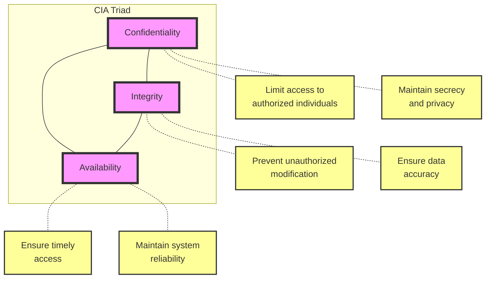
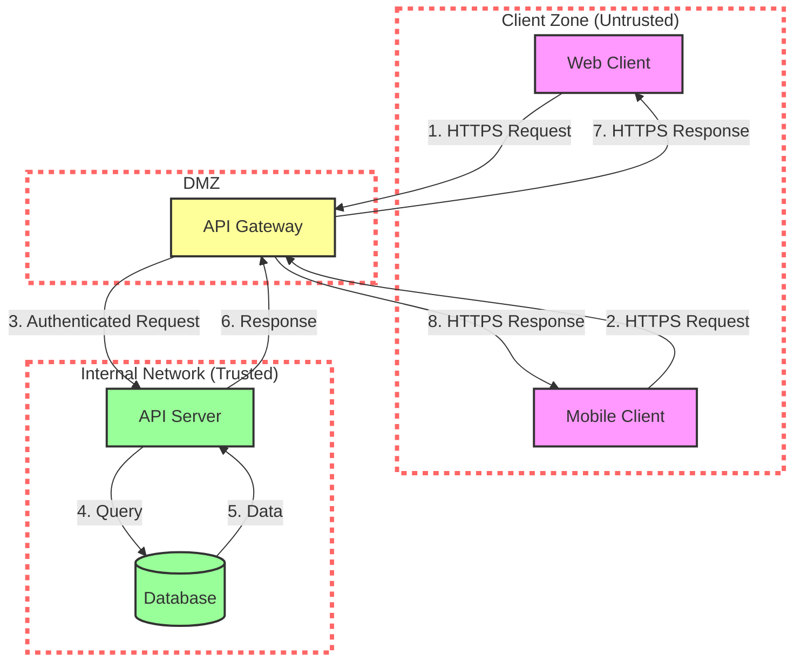

# The API Security Blueprint

> **Purpose**: A comprehensive guide to API security fundamentals, covering core principles, threat modeling, and security mechanisms. This template provides educational content on the CIA triad, STRIDE threat model, and essential security strategies.

---

## Introduction

A secure API is not merely a collection of isolated features; it requires a holistic strategy that addresses various aspects. This blueprint guides you through the fundamental principles and practices of API security, from identifying assets to implementing defense mechanisms.

---

## Identifying Your Assets: What Needs Protection?

Assets encompass the valuable data and resources that require protection. This can include physical infrastructure, like servers and databases, or digital assets like user data, financial information, and intellectual property.

### Physical Assets
- Servers and data centers
- Network infrastructure
- Storage devices
- Security cameras and restricted access controls

### Digital Assets
- User data (personal information, credentials)
- Financial information
- Intellectual property
- API keys and secrets
- Business logic and algorithms

Protecting physical assets often involves measures like security cameras and restricted access. However, safeguarding digital assets, which are often more vulnerable to remote attacks, demands a different set of strategies. Failure to protect these assets can lead to reputational damage, financial losses, and legal repercussions.

**Think About It**: What are the most critical digital assets in your API? How would a breach of each asset impact your users and business?

---

## Setting Your Security Objectives: The CIA Triad

To guide the design and implementation of security measures, we need clear objectives. The CIA triad, a fundamental security model, provides a framework for defining these goals:

- **Confidentiality**: This principle focuses on limiting access to sensitive information only to authorized individuals. It involves implementing measures to maintain secrecy and privacy, protecting data from unauthorized disclosure.

- **Integrity**: This principle aims to maintain the accuracy and trustworthiness of data. It involves preventing unauthorized modification, alteration, or corruption of information, whether intentional or accidental.

- **Availability**: This principle emphasizes the timely and reliable access to data and resources by authorized users. It involves ensuring systems and services are operational and accessible when needed.

**Think About It**: How do these three principles sometimes conflict? Can you think of a scenario where ensuring availability might compromise confidentiality?

---

## Threat Modeling: Anticipating and Mitigating Risks

To effectively protect an API, it's essential to understand the potential threats it faces. This involves creating a threat model, a systematic analysis of potential vulnerabilities and attacks.

### The STRIDE Framework

The STRIDE acronym provides a helpful framework for classifying threats:

| STRIDE Category | Threat Description |
|----------------|-------------------|
| **Spoofing** | Impersonating a legitimate user or system. |
| **Tampering** | Modifying data or code without authorization. |
| **Repudiation** | Denying responsibility for an action or event. |
| **Information Disclosure** | Exposing sensitive data to unauthorized parties. |
| **Denial of Service** | Disrupting access to a system or service. |
| **Elevation of Privilege** | Gaining unauthorized access to higher privileges. |

**Think About It**: Can you recall a well-known security breach that exemplifies one or more of the STRIDE threats?

### The Threat Modeling Process

The threat modeling process typically involves:

1. **Creating a system diagram** that outlines the key components (clients, endpoints, databases, etc.) and their trust boundaries.

2. **Identifying the flow of information** between these components.

3. **Analyzing each trust boundary** to pinpoint potential threats, often using the STRIDE model as a guide.

4. **Selecting and implementing appropriate security mechanisms** to address these identified threats.

### Trust Boundaries

Trust boundaries are critical points in your system where data moves from one security context to another. Common trust boundaries include:

- Client to API Gateway (untrusted to semi-trusted)
- API Gateway to internal services (semi-trusted to trusted)
- Application to database (trusted to highly trusted)

Different APIs have different threat profiles. A public API handling sensitive user data will require more stringent security measures than an internal API accessing non-critical information.

**Think About It**: Where are the trust boundaries in your API? What threats are most likely at each boundary?

---

## Security Mechanisms

Threat modeling helps identify potential vulnerabilities. To address these risks, we employ various security mechanisms:

### Encryption

Safeguards data in transit and at rest, making it unreadable to unauthorized parties even if intercepted.

- **Transport Layer Security (TLS)**: Commonly used to encrypt API communication over HTTPS
- **Data at Rest Encryption**: Protects stored data in databases and file systems
- **End-to-End Encryption**: Ensures data remains encrypted throughout its journey

**Application**: Always use HTTPS for API endpoints. Consider encrypting sensitive fields in your database.

### Validation

Verifies the correctness and trustworthiness of incoming data, preventing malicious input from compromising the system.

- **Input Validation**: Check data types, formats, ranges, and patterns
- **Schema Validation**: Ensure requests match expected structure
- **Sanitization**: Remove or escape potentially dangerous characters

**Application**: Validate all user input on the server side, never trust client-side validation alone.

### Authentication

Confirms the identity of users or systems before granting access.

- **Token-Based**: JWT, OAuth tokens
- **API Keys**: Simple shared secrets
- **Mutual TLS**: Certificate-based authentication
- **Multi-Factor Authentication (MFA)**: Additional verification beyond passwords

**Application**: Choose authentication method based on your API's security requirements and user experience needs.

### Authorization

Determines what actions authenticated users are permitted to perform, enforcing access control and preventing unauthorized data modification.

- **Role-Based Access Control (RBAC)**: Permissions based on user roles
- **Attribute-Based Access Control (ABAC)**: Fine-grained permissions based on attributes
- **Resource-Based Permissions**: Control access to specific resources

**Application**: Implement the principle of least privilege—users should only have access to what they need.

**Think About It**: How do authentication and authorization work together? Why is having both essential?

---

## Security Best Practices

### Defense in Depth
Implement multiple layers of security controls. If one fails, others provide backup protection.

### Fail Securely
When errors occur, ensure the system fails to a secure state (e.g., deny access rather than grant it).

### Logging and Monitoring
Track security events to detect and respond to threats. Log authentication attempts, authorization failures, and suspicious patterns.

### Regular Security Audits
Periodically review your security posture through:
- Code reviews focused on security
- Penetration testing
- Dependency vulnerability scanning
- Security architecture reviews

### Keep Dependencies Updated
Regularly update libraries and frameworks to patch known vulnerabilities.

---

## Conclusion

API security requires a comprehensive approach that combines understanding your assets, defining clear security objectives through the CIA triad, identifying threats through systematic modeling (STRIDE), and implementing appropriate security mechanisms.

Remember:
- Security is not a one-time implementation but an ongoing process
- Each API has unique security requirements based on its threat profile
- Always balance security with usability—overly restrictive security can harm user experience
- Stay informed about emerging threats and evolving best practices

**Final Thought**: What's one security improvement you could implement in your API today?
